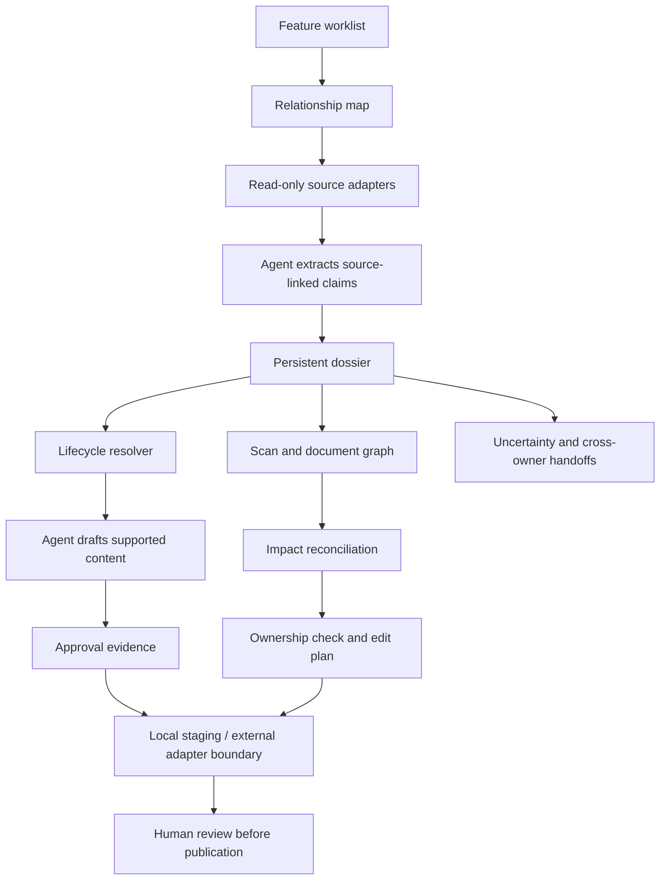

# How Atlas carries a feature

Atlas separates **decisions that need interpretation** from **mechanics that
should behave the same way on every run**. An agent reads evidence and writes a
draft. Python stores the dossier, reconciles state, checks ownership, and builds
reviewable plans. A future adapter must enforce any actual external writes.

## Keep evidence attached

A dossier records feature identity, scope, facts, sources, confidence, conflicting
positions, unavailable sources, affected documents, and draft state. Repeated
merges union the available evidence instead of duplicating it. Human-set conflict
resolutions survive later patches. JSON supports tools; Markdown supports review.
See [dossier schema](../references/dossier-schema.md).

## Reconcile state before taking the next step

A work item saying “published” is weaker evidence than a verified published
document. A release branch is staging, not publication. The lifecycle resolver
keeps those states distinct and reports conflicts. Tag transforms are mechanical:
they do not prove that an approval occurred. The host must verify an applicable
review decision against the actual draft before applying a ready tag.

## Discover broadly, edit narrowly

The document-impact stage accepts lexical scan candidates and graph candidates.
Agreement can increase confidence; a graph edge alone remains an inference.
Platform mismatches and high-connectivity overview pages are separated from
direct feature targets. The edit planner batches owned, supported targets and
creates typed handoffs for the rest. The host rechecks actual file ownership
immediately before executing a proposed edit.

## Make interruptions recoverable

Persistent dossiers, feature notes, notification ledgers and handoff records let a
later run inspect what is known. A queued notification is not a send receipt.
Only the caller that confirms an actual send should mark it announced. A timeline
change produces a move plan instead of silently leaving content staged for the
wrong release.

## Public demo versus a connected deployment

The public demo supplies pre-extracted fictional claims and a template draft.
It invokes actual planning/state modules and creates local proposed artifacts.
It has no live connectors, model client, scheduler, or external write executor.
The [skills](../skills/atlas-pipeline/SKILL.md) describe where an agent performs
research and drafting; the [adapter contracts](adapters.md) describe what a
connected integration must provide. These are integration specifications, not
claims that such connections are installed.
